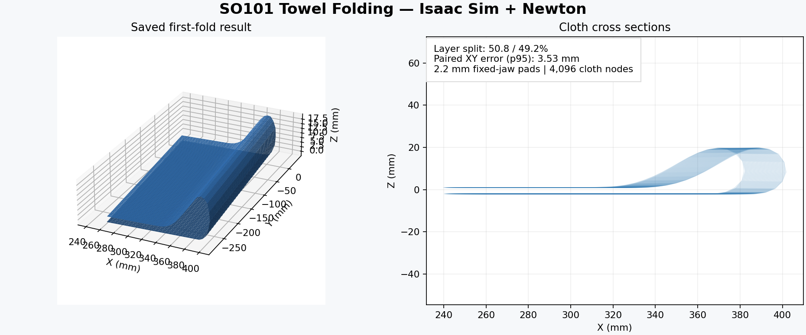

# SO101 Towel Folding

Isaac Sim과 Newton에서 두 대의 SO-101로 수건을 집고, 들어 올려 반으로 접은 뒤 내려놓는 시뮬레이션이다.



## 결과

| 항목 | 값 |
| --- | --- |
| 수건 | 300 × 300 mm, 4,096 노드 |
| 고정 턱 패드 | 2.2 mm |
| 접힌 길이 비율 | 50.8 : 49.2 |
| 대응 노드 XY 오차, p95 | 3.53 mm |
| 접힌 폭 | 161.82 mm |

전체 동작과 놓기 검사를 통과한 `fine_compact` 1차 접기 실행 1회를 보존한다. 입자 부착 없이 접촉으로 수행했으며, 관절 상태를 직접 지정하고 Newton을 단방향으로 결합한다. 수건 물성·마찰의 실물 일치, 반복 성공률, 2차 접기는 검증 범위에 포함하지 않는다.

## 실행

저장된 입력·모델·결과 검사에는 GPU가 필요 없다.

```bash
python -m pip install -r requirements-check.txt
python tools/run_first_fold.py --check
```

시뮬레이션에는 Ubuntu x86-64, Python 3.12, NVIDIA GPU, Isaac Sim 6.0.1과 Newton 지원 Isaac Lab이 필요하다. 확인된 개발 환경은 Isaac Lab `367e498138c233e56896f3deb818aaed8a094dd8`(6.1.17), Newton 1.2.1, Warp 1.13.0, Torch 2.10.0+cu128, MuJoCo 3.8.0 / mujoco-warp 3.8.0.3이다. Isaac Lab의 `isaaclab_physx`, `isaaclab_newton`, `isaaclab_contrib.deformable` 모듈이 필요하다.

```bash
export ISAAC_PYTHON=/path/to/isaac-environment/bin/python
"$ISAAC_PYTHON" -m pip install -r requirements-simulation.txt
"$ISAAC_PYTHON" tools/run_first_fold.py --run --gui
```

`--gui`를 빼면 창 없이 실행한다. 물리를 다시 계산하는 방식이며 영상 재생 기능은 아니다. 출력은 `output/`의 새 폴더에 저장된다. GUI에서는 종료 후 창을 닫으면 결과 검사가 이어진다.

## 파일

- `config/first_fold_recipe.json`: 성공 실행 설정
- `tools/run_first_fold.py`: 검사·실행 진입점
- `artifacts/`, `ros2_ws/src/so101_description/meshes/`: 경로·URDF·메시
- `results/first_fold/verification.json`: 성공 결과 요약
- `results/first_fold/provenance.json`: 원본 입력과 배포 변경 기록

공개 자료의 파일·모델·저장 결과 검사는 통과했다. 배포 시 GPU 드라이버 연결 문제로 전체 재실행은 하지 않았으며, 포함된 성공 결과는 기존 실행 기록이다. 원본 결과의 `s1_completed=false`는 실물 검증 등을 포함한 별도 완료 기준이다.

라이선스는 [Apache-2.0](LICENSE), 모델 출처는 [NOTICE](NOTICE.md)를 참고한다.
